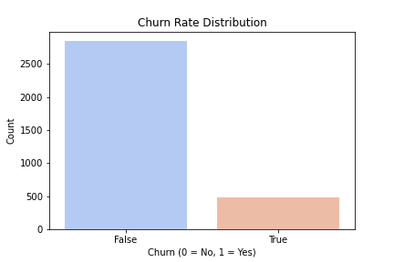
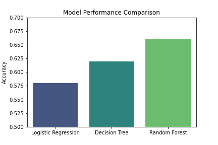
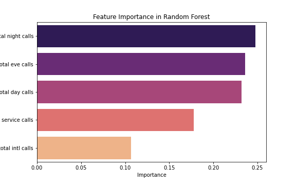

# SyriaTel Customer Churn Prediction

This project aims to classify whether a customer is likely to churn using data from SyriaTel. By leveraging machine learning techniques, we help the company implement proactive retention strategies and reduce revenue loss.

## Tech Stack
- Python
- Pandas
- Matplotlib
- Seaborn
- Scikit-Learn

## Business Context
Customer churn leads to revenue loss and higher customer acquisition costs. Understanding churn patterns allows SyriaTel to implement data-driven retention strategies, improving long-term customer value.

## Business Problem
SyriaTel faces significant customer churn. Our goal is to build a classifier that predicts whether a customer will leave soon, allowing SyriaTel to take proactive measures to retain them.

## Data Understanding
The dataset includes customer demographic details, service usage patterns, and historical churn labels. By analyzing this data, we can identify patterns that signal potential churn.

### Churn Rate Distribution

## Feature Engineering
The following features were included in the final model:
- **Included:**
  - Customer demographics (age, tenure, etc.)
  - Service usage metrics
  - Call frequency and international plan status
  - Historical churn labels
- **Engineered:**
  - Interaction variables between service usage and tenure
  - Categorical encoding for non-numeric variables

## Modeling Approach
We tested multiple models to determine the best classifier for predicting customer churn:
- **Logistic Regression:** Simple and interpretable baseline.
- **Decision Trees:** Helps identify key churn factors.
- **Random Forest:** More advanced model with better accuracy.
- **SMOTE:** Used to address class imbalance.
- **Hyperparameter Tuning:** Optimized model performance.

### Model Performance Visualization

## Model Performance
The Random Forest model performed the best, achieving an accuracy of approximately **66%**. Key performance metrics included:
- **Accuracy:** Measures overall correctness of predictions.
- **Precision:** Focuses on correctly identifying real churners.
- **Recall:** Ensures maximum identification of churners.
- **F1-score:** Balances precision and recall.

### Feature Importance

## Key Findings
- **Best Model:** Random Forest
- **Top Churn Indicators:**
  - High service usage
  - International plan subscription
  - Frequent customer support calls

## Recommendations
1. Implement personalized retention offers for high-risk customers.
2. Improve customer experience with proactive support and incentives.
3. Use data-driven insights to refine loyalty programs.
4. Continuously monitor and refine the churn prediction model.

## Next Steps
1. Deploy the best-performing model in production.
2. Continuously update the model with new data.
3. Conduct A/B testing to evaluate the impact of retention strategies.

## Contact
For any questions or discussions, feel free to connect:
- **LinkedIn:** Betsy Gitije
- **GitHub:** BetsyGitije

